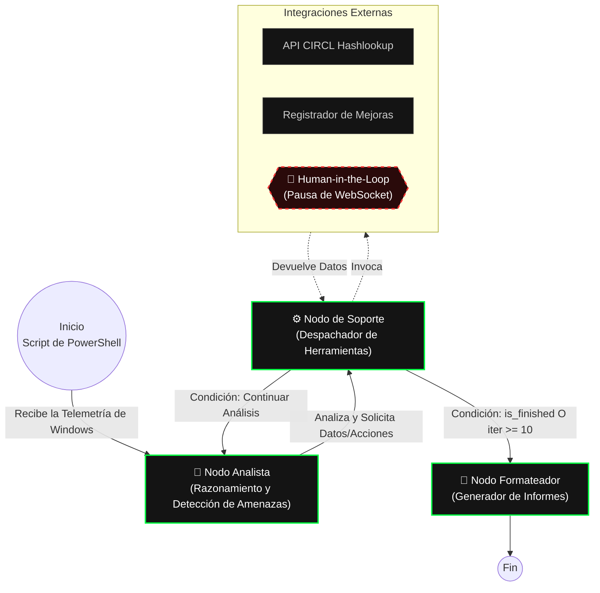

# SafecurityAI
Una plataforma forense multiagente que orquesta el análisis de telemetría de *endpoints* a través de LangGraph, con un backend asíncrono basado en WebSockets para la intervención en tiempo real mediante *Human-in-the-Loop* (HITL - Humano en el bucle).

> 📘 **This document is also available in English:**  
> [Read in English](README.md)

## App Demo
https://github.com/user-attachments/assets/756e4de5-91b0-4245-a436-b1850a819032

## Vectores de detección de amenazas

El *pipeline* subyacente de telemetría de PowerShell extrae información profunda del estado del sistema, que la IA evalúa para identificar amenazas persistentes avanzadas (APT), malware y anomalías en el sistema. El análisis abarca:

* **Evasión de seguridad:** Inspección crítica de exclusiones alteradas de Windows Defender y archivos HOSTS envenenados.
* **Integridad de procesos y redes:** Validación de firmas criptográficas de procesos activos (`Win32_Process`) correlacionados con conexiones TCP activas (`Netstat`) para detectar procesos enmascarados o inyectados.
* **Mecanismos de persistencia:** Auditoría profunda de programas de inicio, Servicios de Windows y Tareas Programadas (incluyendo la resolución de objetos COM).
* **Secuestro de aplicaciones (Application Hijacking):** Inspección de extensiones de navegador y entornos de desarrollo (ej. VSCode) en busca de *sideloading* (carga lateral) malicioso.

## Configuración y ejecución local

### Requisitos previos
* Python 3.13+
* Node.js 24+
* Clave de API de Google Gemini (Google Gemini API Key)

Crea un archivo `.env` en el directorio raíz y añade tu clave de API:
```env
GOOGLE_API_KEY=tu_clave_de_api_de_gemini_aqui
```

### Instalación
**Backend (Poetry):**
```bash
poetry install
```

**Frontend (npm):**
```bash
cd frontend
npm ci
```

### ⚠️ Ejecución (Se requieren privilegios de Administrador)
Para recopilar una telemetría precisa, el backend **debe ejecutarse con privilegios elevados / de Administrador**. 

El *payload* subyacente de PowerShell (`scan_windows.ps1`) requiere acceso administrativo para eludir las políticas de ejecución locales, consultar las exclusiones de Windows Defender (`Get-MpPreference`), validar criptográficamente las firmas de `Win32_Process` y mapear las conexiones TCP activas de `Netstat`. Sin estos privilegios, el análisis fallará o producirá datos incompletos.

**Iniciar el Backend:**
```bash
# Ejecutar desde una terminal como Administrador
poetry run python run.py
```

**Iniciar el Frontend:**
```bash
cd frontend
npm run dev
```

## Arquitectura del sistema y orquestación de agentes

SafecurityAI utiliza una máquina de estados construida sobre LangGraph (`AgentState`) para enrutar la ejecución entre nodos de LLM especializados.

*   **Nodo Analista (Analyst Node):** Ingiere la telemetría en formato JSON y el historial de ejecución. Evalúa anomalías del sistema, solicita herramientas externas si es necesario, o decide cuándo se ha completado la auditoría.
*   **Nodo de Soporte (Supporter Node):** Actúa como el Ejecutor de Herramientas. Traduce los requisitos del Analista en acciones concretas, invocando herramientas como la API CIRCL Hashlookup o pausando la ejecución para solicitar intervención humana (`human_task`).
*   **Nodo Formateador (Formatter Node):** Compila todo el rastro de razonamiento y los registros (*logs*) sin procesar en un informe forense final y estructurado en formato Markdown/PDF.



Para evitar bucles descontrolados del LLM o el agotamiento de la API, la máquina de estados aplica un estricto límite de iteraciones (`iteration_count >= 10`), forzando al flujo de trabajo a salir hacia el Formateador si se alcanza dicho límite.

### Estrategia del Modelo
Actualmente, el sistema está configurado para usar `gemini-3.1-flash-lite-preview` en todos los nodos. Esta configuración se adapta a los límites de la capa gratuita (aprox. 500 peticiones/día). 

Para entornos de producción o análisis heurístico más profundo, es altamente recomendable actualizar el **Nodo Analista** a un modelo de razonamiento de mayor capacidad. El **Nodo de Soporte**, siendo principalmente un despachador rápido de llamadas a herramientas, puede permanecer en un modelo más ligero y rápido sin degradar el rendimiento del sistema.

## Comunicación en tiempo real e inyección de dependencias

Uno de los principales retos arquitectónicos fue transmitir (*stream*) los rastros de ejecución al cliente y pausar el grafo para la entrada de datos humanos, lo cual requiere mantener una conexión WebSocket con estado (*stateful*) a través de nodos de LangGraph asíncronos y aislados.

Para mantener la lógica del grafo limpia y desacoplada de la capa de transporte, el proyecto utiliza un patrón de Inyección de Dependencias mediante `GraphConfig`:

1.  **Inyección:** Al inicio del flujo de trabajo, el envoltorio del WebSocket activo (`BaseNotifier`) se inyecta en el `RunnableConfig` del grafo (`GraphConfig.set_notifier()`).
2.  **Recuperación:** Cualquier nodo o herramienta que requiera de entrada/salida (I/O) simplemente llama a `GraphConfig.get_notifier(config)` para extraer el contexto de conexión de forma segura.

Esta abstracción asegura que el flujo de trabajo agéntico permanezca completamente ajeno al protocolo de transporte subyacente, permitiendo que el notificador se pueda simular (*mockear*) fácilmente (`VoidNotifier`) para pruebas o para su ejecución en segundo plano.

### Human-in-the-Loop (HITL)
FastAPI mantiene la conexión WebSocket activa, mientras que el frontend en React consume el flujo de datos. Cuando el agente de Soporte (`Supporter`) activa una tarea humana (`human_task`), el grafo de ejecución se suspende. El frontend renderiza un *prompt* del sistema solicitando una entrada de texto por parte del usuario, y el análisis se reanuda automáticamente una vez que el *payload* de respuesta se transmite de vuelta al backend.

## Suite de Pruebas

**Backend (Pruebas unitarias y Linting):**
`pytest` para la lógica de la API/LangGraph y `Ruff` para el linting y formateo.
```bash
poetry run pytest
poetry run ruff check .
```

**Frontend (Pruebas unitarias):**
Pruebas aisladas de componentes y *custom hooks* (hooks personalizados) utilizando `Vitest` y React Testing Library.
```bash
cd frontend
npm run test
```

**Extremo a Extremo (E2E):**
Los flujos de usuario (conexiones WebSocket, transiciones de estado de la interfaz de usuario y generación de informes en PDF) están cubiertos por `Playwright`.
```bash
cd frontend
npx playwright test
```