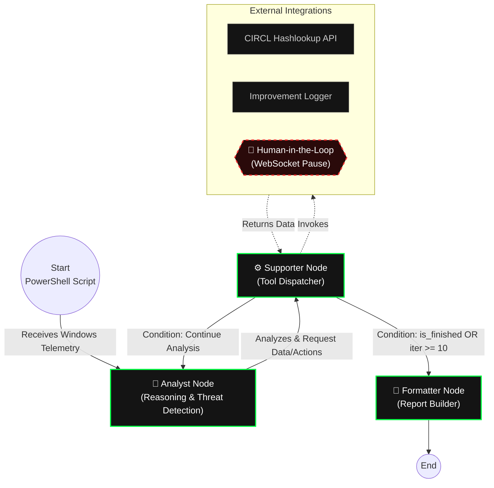

# SafecurityAI
A multi-agent forensic platform orchestrating endpoint telemetry analysis via LangGraph, featuring an asynchronous WebSocket backend for real-time Human-in-the-Loop (HITL) intervention.

> 📘 **Este documento también está disponible en español:**  
> [Leer en español](README-es.md)

## App Demo
https://github.com/user-attachments/assets/756e4de5-91b0-4245-a436-b1850a819032

## Threat Detection Vectors

The underlying PowerShell telemetry pipeline extracts deep system state information, which the AI evaluates to identify advanced persistent threats (APTs), malware, and system anomalies. The analysis covers:

* **Security Evasion:** Critical inspection of altered Windows Defender exclusions and poisoned HOSTS files.
* **Process & Network Integrity:** Cryptographic signature validation of active processes (`Win32_Process`) correlated with active TCP connections (`Netstat`) to detect masquerading or injected processes.
* **Persistence Mechanisms:** Deep auditing of Startup programs, Windows Services, and Scheduled Tasks (including COM object resolution).
* **Application Hijacking:** Inspection of browser extensions and developer environments (e.g., VSCode) for malicious sideloading.

## Local Setup & Execution

### Prerequisites
* Python 3.13+
* Node.js 24+
* Google Gemini API Key 

Create a `.env` file in the root directory and add your API key:
```env
GOOGLE_API_KEY=your_gemini_api_key_here
```

### Installation
**Backend (Poetry):**
```bash
poetry install
```

**Frontend (npm):**
```bash
cd frontend
npm ci
```

### ⚠️ Execution (Admin Privileges Required)
To collect accurate telemetry, the backend **must be executed with Administrator / Elevated privileges**. 

The underlying PowerShell payload (`scan_windows.ps1`) requires administrative access to bypass local execution policies, query Windows Defender exclusions (`Get-MpPreference`), cryptographically validate `Win32_Process` signatures, and map active `Netstat` TCP connections. Without these privileges, the analysis will fail or yield incomplete data.

**Start the Backend:**
```bash
# Run from an Administrator terminal
poetry run python run.py
```

**Start the Frontend:**
```bash
cd frontend
npm run dev
```

## System Architecture & Agent Orchestration

SafecurityAI utilizes a state machine built on LangGraph (`AgentState`) to route execution between specialized LLM nodes.

*   **Analyst Node:** Ingests the JSON telemetry and the execution history. It evaluates system anomalies, requests external tools if needed, or decides when the audit is complete.
*   **Supporter Node:** Acts as the Tool Executor. It translates the Analyst's requirements into concrete actions, invoking tools such as the CIRCL Hashlookup API or pausing execution to request human intervention (`human_task`).
*   **Formatter Node:** Compiles the entire reasoning trace and raw logs into a final, structured forensic report in Markdown/PDF format.



To prevent runaway LLM loops or API exhaustion, the state machine enforces a strict iteration limit (`iteration_count >= 10`), forcing the workflow to exit to the Formatter if the limit is reached.

### Model Strategy
Currently, the system is configured to use `gemini-3.1-flash-lite-preview` across all nodes. This setup accommodates the free-tier limits (approx. 500 requests/day). 

For production environments or deeper heuristic analysis, it is highly recommended to upgrade the **Analyst Node** to a higher-capacity reasoning model. The **Supporter Node**, being primarily a fast tool-calling dispatcher, can remain on a lighter, faster model without degrading the system's performance.

## Real-Time Communication & Dependency Injection

One of the primary architectural challenges was streaming execution traces to the client and pausing the graph for human input, which requires maintaining a stateful WebSocket connection across asynchronous, isolated LangGraph nodes.

To keep the graph logic clean and decoupled from the transport layer, the project uses a Dependency Injection pattern via `GraphConfig`:

1.  **Injection:** At the start of the workflow, the active WebSocket wrapper (`BaseNotifier`) is injected into the graph's `RunnableConfig` (`GraphConfig.set_notifier()`).
2.  **Retrieval:** Any node or tool requiring I/O simply calls `GraphConfig.get_notifier(config)` to safely extract the connection context.

This abstraction ensures that the agentic workflow remains entirely unaware of the underlying transport protocol, allowing the notifier to be easily mocked (`VoidNotifier`) for testing or background execution.

### Human-in-the-Loop (HITL)
FastAPI maintains the active WebSocket connection, while the React frontend consumes the stream. When the `Supporter` agent triggers a `human_task`, the execution graph is suspended. The frontend renders a system prompt requesting an input from the user, and the analysis automatically resumes once the response payload is transmitted back to the backend.

## Testing Suite

**Backend (Unit Testing & Linting):**
`pytest` for the API/LangGraph logic and `Ruff` for linting and formatting.
```bash
poetry run pytest
poetry run ruff check .
```

**Frontend (Unit Testing):**
Isolated component and custom hooks testing using `Vitest` and React Testing Library.
```bash
cd frontend
npm run test
```

**End-to-End (E2E):**
User flows (WebSocket connections, UI state transitions, and PDF report generation) are covered by `Playwright`.
```bash
cd frontend
npx playwright test
```
